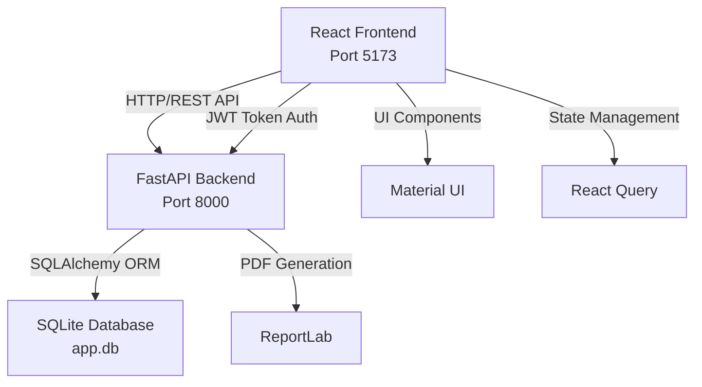

# Telemedizin Patient Portal - Technical Documentation

## 1. Introduction

### Purpose
This telemedicine patient portal is an **educational demonstration** developed as part of a medical engineering student project. It showcases a realistic telemedicine platform for patient-doctor interactions including appointment scheduling, prescription management, lab results, and health information.

**IMPORTANT:** This system is NOT certified for real healthcare use and does NOT replace professional medical advice.

### Scope
The application provides:
- Patient registration and authentication
- Doctor search and appointment booking  
- Prescription and medication management
- Medical reports and laboratory results
- Health tips and FAQ
- Educational symptom checker (non-diagnostic)

---

## 2. Requirements Analysis

### Functional Requirements

**User Roles:**
- PATIENT: Register, login, manage profile, book appointments, view medical data
- DOCTOR: Login, manage appointments, create prescriptions/reports/lab results

**Core Features:**
1. **Termine & Ärzte** - Doctor search, appointment booking, appointment history
2. **Rezepte & Medikamente** - View prescriptions, manage medication reminders, track intake
3. **Berichte & Laborergebnisse** - View and download medical reports and lab results as PDF
4. **Lebenserhaltung & Fitness** - Browse health tips (movement, nutrition, prevention)
5. **Telemedizin-Ratgeber** - FAQ and educational symptom checker
6. **Benutzerkonto** - Profile management and password change

### Non-Functional Requirements
- **Security:** JWT-based authentication, password hashing (bcrypt)
- **Performance:** Fast response times with React Query caching
- **Usability:** Clean Material UI design, German language interface
- **Maintainability:** TypeScript for type safety, clear code structure
- **Portability:** SQLite database for easy local setup

---

## 3. System Architecture

### Architecture Overview



### Technology Stack

**Backend:**
- FastAPI - Modern Python web framework
- SQLAlchemy - ORM for database operations  
- Alembic - Database migrations
- SQLite - Local file-based database
- Python-Jose - JWT token handling
- Passlib + Bcrypt - Password hashing
- ReportLab - PDF generation

**Frontend:**
- React 18 + TypeScript - UI framework
- Vite - Build tool and dev server
- Material UI (MUI) - Component library
- React Router - Client-side routing
- React Query - Server state management
- Axios - HTTP client

---

## 4. Backend Design

### Database Schema

**Core Entities:**

- **User** - Authentication (email, password_hash, role)
  - → Patient relation (1:1)
  - → Doctor relation (1:1)

- **Appointment** - Scheduling (date, time, type, status)
  - → Patient (many:1)
  - → Doctor (many:1)

- **Prescription** - Medication prescriptions
  - → Patient (many:1)
  - → Doctor (many:1)
  - → Medications (1:many)

- **Medication** - Individual medications
  - → Reminders (1:many)
  - → Intake history (1:many)

- **Report** - Doctor reports (title, content, file)
- **LabResult** - Laboratory results (test_name, value, range)
- **HealthTip** - Health content (category, title, content)
- **FAQ** - Frequently asked questions
- **SymptomCheckSession** - Symptom checker logs

### API Endpoints

| Endpoint | Method | Description | Auth |
|----------|--------|-------------|------|
| `/api/auth/register` | POST | Patient registration | No |
| `/api/auth/login` | POST | User login | No |
| `/api/auth/me` | GET | Current user info | Yes |
| `/api/doctors` | GET | Search doctors | No |
| `/api/appointments` | GET, POST | Manage appointments | Yes |
| `/api/prescriptions` | GET | List prescriptions | Patient |
| `/api/reports` | GET | List reports | Patient |
| `/api/reports/{id}/download` | GET | Download PDF | Patient |
| `/api/lab-results` | GET | List lab results | Patient |
| `/api/content/health-tips` | GET | Health tips | No |
| `/api/content/faq` | GET | FAQ list | No |
| `/api/symptom-checker` | POST | Symptom analysis | Optional |

### Authentication Flow

1. User submits credentials to `/api/auth/login`
2. Backend validates password (bcrypt)
3. JWT access token generated and returned
4. Frontend stores token in localStorage
5. Token included in Authorization header for protected routes
6. Backend verifies token and extracts user identity
7. Role-based access control applied per endpoint

---

## 5. Frontend Design

### Component Architecture

```
App.tsx (Router)
├── Auth Pages (Public)
│   ├── LoginPage
│   └── RegisterPage
└── MainLayout (Protected)
    ├── Navbar (AppBar)
    ├── Sidebar (Drawer)
    └── Page Content
        ├── DashboardPage
        ├── DoctorSearchPage
        ├── AppointmentsPage
        ├── PrescriptionsPage
        ├── ReportsPage
        ├── LabResultsPage
        ├── HealthTipsPage
        ├── FAQPage
        ├── SymptomCheckerPage
        └── AccountPage
```

### State Management

- **AuthContext** - User authentication state, login/logout functions
- **React Query** - Server data caching, loading states, automatic refetching
- **Local State** - Form inputs, UI toggles

### Routing

All routes require authentication except `/login` and `/register`. Users are redirected to login if not authenticated.

---

## 6. Implementation Details

### Password Security

```python
from passlib.context import CryptContext
pwd_context = CryptContext(schemes=["bcrypt"], deprecated="auto")

# Hashing
password_hash = pwd_context.hash(plain_password)

# Verification  
is_valid = pwd_context.verify(plain_password, password_hash)
```

### PDF Generation

Reports and lab results can be downloaded as PDFs using ReportLab:

```python
from reportlab.pdfgen import canvas

def generate_report_pdf(report, patient_name, doctor_name):
    buffer = BytesIO()
    p = canvas.Canvas(buffer, pagesize=letter)
    p.drawString(50, height - 50, f"Report: {report.title}")
    # ... add content
    p.save()
    return buffer.getvalue()
```

### Symptom Checker Logic

Simple rule-based system (non-diagnostic):

```python
def analyze_symptoms(category, severity, duration):
    if severity == "severe":
        return "High urgency - seek medical attention promptly"
    elif severity == "moderate":
        return "Monitor symptoms, schedule appointment if persistent"
    else:
        return "Low urgency - observe and seek care if worsening"
```

**Prominent Disclaimer:** "This tool does NOT provide medical diagnoses and does NOT replace a doctor visit."

---

## 7. Testing

### Backend Tests (pytest)

Test files in `backend/tests/`:
- `test_auth.py` - Registration, login, token validation
- `test_appointments.py` - CRUD operations, authorization
- `test_prescriptions.py` - Prescription management

Run tests: `pytest`

### Frontend Tests (Vitest)

Basic component tests for key pages.

Run tests: `npm run test`

---

## 8. Deployment & Running

### Prerequisites
- Python 3.11+
- Node.js 18+ and npm
- Git

### Local Setup

**Backend:**
```bash
cd backend
python -m venv venv
venv\Scripts\activate  # Windows
pip install -r requirements.txt
copy .env.example .env
python seed_data.py    # Creates database and demo data
uvicorn main:app --reload
```

Backend runs on http://localhost:8000
API docs: http://localhost:8000/docs

**Frontend:**
```bash
cd frontend
npm install
npm run dev
```

Frontend runs on http://localhost:5173

### Demo Login Credentials
- Patient: `demo.patient@example.com` / `password123`
- Doctor: `demo.doctor@example.com` / `password123`

### Database Migrations

```bash
cd backend
alembic revision --autogenerate -m "Description"
alembic upgrade head
```

---

## 9. Limitations & Future Work

### Current Limitations
- SQLite not suitable for production with concurrent users
- No real-time notifications or WebSocket support
- No email/SMS for appointment reminders
- Symptom checker is rule-based, not ML-powered
- No video/chat implementation (UI only)
- Limited to German language

### Future Improvements
- Migrate to PostgreSQL for production
- Add real-time features with WebSockets
- Implement actual video conferencing (WebRTC)
- Enhanced symptom analysis (while maintaining non-diagnostic nature)
- Multi-language support
- Mobile app (React Native)
- Advanced security hardening
- Comprehensive logging and monitoring
- Automated backup and disaster recovery

---

## Conclusion

This telemedicine portal demonstrates modern full-stack web development practices while serving as an educational tool for understanding telemedicine systems. The clean architecture, strong typing, and comprehensive feature set provide a solid foundation that could be extended for real-world applications with appropriate medical certifications and regulatory compliance.

**Remember:** This is an educational demonstration. Always consult qualified healthcare professionals for medical advice.
